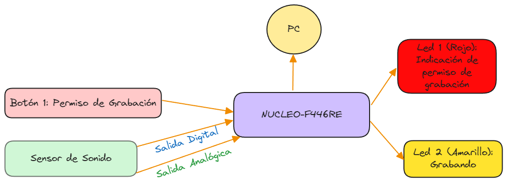

# TP_1 Sistemas Embebidos

## Título: Sistema de grabación de sonido ambiente.

### Alumno: Rigoberto Acosta González (rigo93acosta@gmail.com)

#### Objetivo: Desarrollar un sistema de grabación de sonido ambiente.

##### Descripción: 

El sistema a través del sensor de sonido realizará la grabación de sonido ambiente. El sistema grabará si el sensor de sonido supera cierto umbral de sonido y si la opción de permiso de  grabado está activada. Al cumplirse las dos condiciones anteriores el sistema a través del micrófono del sensor realizará la grabación y dicha grabación será enviada por comunicación serie a la PC. La grabación enviada será de 1000 muestra, equivalente a 420 $\mu\text{s}$, considerando que los **ADC** internos tiene como frecuencia de muestreo $2.4~\text{MSPS}$, tomando aproximadamente una muestra cada 420 $\text{ns}$. 

Existen dos LEDs de indicación con las siguiente funcionalidades:
- LED 1: Estará encendido si está permitdo realizar la grabación, este led se activa por el Botón 1, de lo contrario estará apagado, por tanto no se permitirá la grabación de sonido ambiente.
- LED 2: Estará encendido durante el proceso de grabación de sonido ambiente y envío de muestras por puerto serie.

> Es importante destacar que el sensor de sonido nos devuelve un valor digital de bajo nivel si supera cierto umbral de sonido predefinido anteriormente, por tanto en este instante comenzaría el proceso de grabación. 

Plataforma de desarrollo: NUCLEO-F446RE
Periféricos a utilizar:
- USER BUTTON: Activa/Desactiva el sistema para grabar.
- LED 1: Se enciende para indicar que el sistema tiene permito grabar para grabar.
- LED 2:  Se enciende para indicar que el sistema está grabando y transmitiendo por puerto serie.
- ANALOG IN A0: Se utiliza para leer la información del micrófono del sensor.
- DIGITAL IN D2: Se utiliza para leer la bandera de superación de umbral de sonido del micrófono del sensor.
- UART: Se utiliza para enviar información del sistema a la PC.

La grabación de sonido se realiza mediante un sensor de sonido (con micrófono):
- https://www.mercadolibre.com.ar/modulo-sensor-de-sonido-microfono-ky-037-arduino-ptec-ky037/p/MLA32489950
