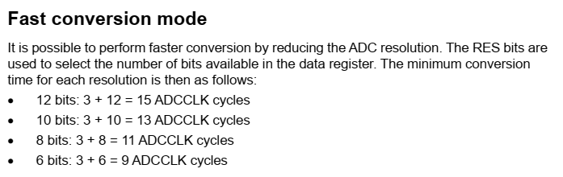

# TP_1 Sistemas Embebidos

## Título: Sistema de grabación de sonido ambiente.

### Alumno: Rigoberto Acosta González (rigo93acosta@gmail.com)

#### Objetivo: Desarrollar un sistema de grabación de sonido ambiente.

##### Descripción: 

El sistema a través del sensor de sonido realizará la grabación de sonido ambiente. El sistema grabará si el sensor de sonido supera cierto umbral de sonido y si la opción de permiso de  grabado está activada. Al cumplirse las dos condiciones anteriores el sistema a través del micrófono del sensor realizará la grabación y dicha grabación será enviada por comunicación serie a la PC. La grabación enviada será de 5000 muestra, considerando que los **ADC** internos tiene como frecuencia de muestreo típica de $30~\text{MHz}$ (por defecto), en el tiempo total de conversión es de $16.40~\mu\text{s}$, entonces el tiempo total de grabación sería de aproximadamente 82 $\text{ms}$ para el total de muestras. 

Existen dos LEDs de indicación con las siguiente funcionalidades:
- LED 1: Estará encendido si está permitdo realizar la grabación, este led se activa por el Botón 1, de lo contrario estará apagado, por tanto no se permitirá la grabación de sonido ambiente.
- LED 2: Estará encendido durante el proceso de grabación de sonido ambiente y envío de muestras por puerto serie.

> Es importante destacar que el sensor de sonido nos devuelve un valor digital de bajo nivel si supera cierto umbral de sonido predefinido anteriormente, por tanto en este instante comenzaría el proceso de grabación. 

Plataforma de desarrollo: [NUCLEO-F446RE](https://www.st.com/en/microcontrollers-microprocessors/stm32f446re.html)

Periféricos a utilizar:
- USER BUTTON: Activa/Desactiva el sistema para grabar.
- LED 1: Se enciende para indicar que el sistema tiene permito grabar para grabar.
- LED 2:  Se enciende para indicar que el sistema está grabando y transmitiendo por puerto serie.
- ANALOG IN A0: Se utiliza para leer la información del micrófono del sensor.
- DIGITAL IN D2: Se utiliza para leer la bandera de superación de umbral de sonido del micrófono del sensor.
- UART: Se utiliza para enviar información del sistema a la PC.

La grabación de sonido se realiza mediante un sensor de sonido (con micrófono):
- https://www.mercadolibre.com.ar/modulo-sensor-de-sonido-microfono-ky-037-arduino-ptec-ky037/p/MLA32489950

> Conversores Analógicos-Digitales del NUCLEO-F446RE: es importante tener en cuenta los siguientes aspectos:
> 
> 
> 
> 
> En estos se reflejan tanto la frecuencia de reloj (común a todos los ADC), la frecuencia de muestreo y el tiempo de conversión para todos los ADC.
> También se debe destacar que el número de bits de conversión disminuye el tiempo total de conversión
> 

> En los registros **ADC sample time register 1 (ADC_SMPR1)** y **ADC sample time register 2 (ADC_SMPR2)** se puede elegir el tiempo de muestreo para cada ADC de forma individual. Por otra parte, el registrp **ADC common control register (ADC_CCR)** en los **Bits 17:16 ADCPRE: ADC prescaler** se puede elegir la frecuencia del reloj común para todos los ADCs. Estos bit seleccionar un divisor por 2, 4, 6 y 8.

> Tomado de https://www.st.com/resource/en/datasheet/stm32f446re.pdf

> Tomado de https://www.st.com/resource/en/reference_manual/rm0390-stm32f446xx-advanced-armbased-32bit-mcus-stmicroelectronics.pdf